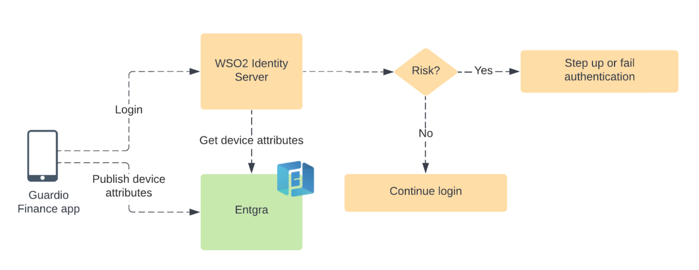

# Device attribute based authentication with WSO2 Identity Server

The WSO2 Identity Server enhances security by leveraging the attributes of a user's mobile device. This approach 
focuses on authenticating users based on the security status of their device. Depending on the device's 
condition – whether it's secure, compromised, or in an unknown state – the system intelligently decides the level of 
authentication required. This method aims to streamline the user experience by minimizing authentication steps for 
secure devices, while enforcing additional security measures or even blocking access when the device poses a 
security risk.

This diagram outlines the authentication flow, highlighting the use of device attributes to enhance security via the 
WSO2 Identity Server. As part of this process, the Guardio Finance app sends the device attributes to Entgra in 
the background. When a user attempts to log in, the WSO2 Identity Server retrieves these attributes from Entgra to 
assess the device's security status. Depending on this evaluation, if a risk is detected, the server may require 
additional authentication steps or block the access attempt to maintain security integrity. On the contrary, if the 
device is assessed to be secure, the server will permit the user to continue with a frictionless login process.

## Getting started

- The connector and other required artifacts can be downloaded from the
  [WSO2 store](https://store.wso2.com/store/assets/isconnector/details/14a8ff5e-5db9-44f4-83cd-8a2534d5892f).

- For detailed steps on setting up and configuring the WSO2 Identity Server, see the documentation
  [here](docs/files/config.md).

- To configure the Entgra IoT Server, follow the instructions in the guide [here](docs/files/entgra.md).

- To see the Entgra adaptive authentication script documentation, Click [here](docs/files/adaptive_script.md).