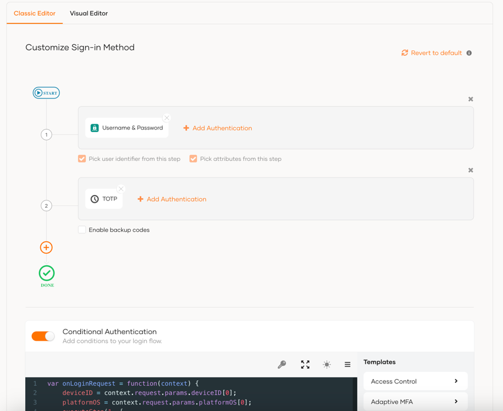

## Configuring the WSO2 Identity Server

1. **Download and Start WSO2 Identity Server**:
    - Download the latest version of WSO2 Identity Server from [https://wso2.com/identity-server/](https://wso2.com/identity-server).
    - Integrate the extension into the Identity Server following the instructions [here](files/artifact.md).
    - Start the WSO2 Identity server and access the console at [http://localhost:9443/console](http://localhost:9443/carbon).

2. **Create and Configure a New Application**:
    - In the WSO2 IS console, navigate to the **Application** section and click on the *New Application* button.
    - Choose **Standard-Based Application**.
    - Provide a name for the application (e.g., ISEntgra), select **OAuth2.0 OpenID Connect** as the protocol, 
   and click **Register**. You will be redirected to the **Protocol** section of the created application.
        - 
    - In the **Protocol** section, enable the **Code** grant type and enter `wso2entgra://oauth2` as the Authorized 
   Redirect URIs. For emulator use, `http://10.0.2.2:8081` can be used as the callback URL.
      -- 
    - Under **Allowed Origins**, input the same URIs as the Redirect URIs and click **Update**.
    - Note the Client ID and Client Secret of the application.

3. **Configure Advanced Settings**:
    - Enable Multi-factor Authentication (MFA) by following the instructions [here](https://is.docs.wso2.com/en/next/guides/authentication/mfa/).
    - For Conditional Authentication, follow the steps [here](https://is.docs.wso2.com/en/next/guides/authentication/conditional-auth/configure-conditional-auth/). Paste the following script in the script editor:

    ```jsx
    var onLoginRequest = function(context) {
        deviceID = context.request.params.deviceID[0];
        platformOS = context.request.params.platformOS[0];
        executeStep(1, {
            onSuccess : function (context) {
                getDeviceInfoEntgra(context, platformOS, deviceID, {
                    onSuccess : function (context, deviceInfo) {
                        if (deviceInfo) {
                            if(deviceInfo.IS_DEV_MODE == "true") {
                                executeStep(2);
                            }
                        }
                    },
                    onFail : function (context, error) {
                        var errorMap = {
                            "errorCode": error.errorCode,
                            "errorMessage" : error.errorMessage
                        };
                        fail(errorMap);
                    }
                });
            }
        }); 
    };
    ```

   > Note: In the `getDeviceInfoEntgra` function’s `onSuccess` event handler, you can access device information 
   > (e.g., `deviceInfo.IS_DEV_MODE`, `deviceInfo.ROOTED`, `deviceInfo.IS_ADB`). 
   > See the [Entgra adaptive authentication script documentation](adaptive_script.md) for more details.
    - 
    - Click the `Update` button to save your changes.

4. **Set Up Entgra Configuration**:
    - Go to the **Login & Registration** section and find the **Entgra Configuration** card under **Other Settings**.
      - 
    - Enter the following configurations:

   | Setting | Value |
       |---------|-------|
   | Enable Entgra | True |
   | Token URL | `https://{hostname}/oauth2/token` |
   | Device Information URL | `https://{hostname}/api/device-mgt/v1.0/devices/1.0.0` |
   | Client Key | Client ID from the Service Provider in Entgra IoT server |
   | Client Secret | Client Secret from the Service Provider in Entgra IoT server |

    - Click `Update` to save these configurations.

[Back to Previous Page](../README.md)
